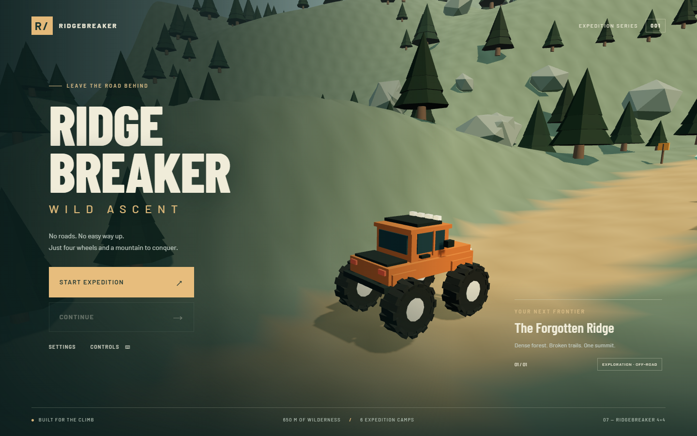

# Ridgebreaker: Wild Ascent

A playable browser 3D off-road expedition inspired by the supplied monster-truck sketch. Drive an oversized orange 4×4 from a forest basecamp to the Forgotten Ridge summit, salvage parts, cross a collapsing bridge, and explore a hidden prototype cave.

This is a working vertical slice, with deliberately simple procedural art and synthesized audio. It is not a finished commercial game. See [KNOWN_ISSUES.md](KNOWN_ISSUES.md) for the remaining work.



## Run locally

Requires Node.js 22.12+ (tested with 24.14), npm, and a browser with WebGL2. Desktop keyboard recommended.

```sh
npm install
npm run dev
```

Open the local URL printed by Vite, normally http://127.0.0.1:5173. Click **Start Expedition**. Fonts and game dependencies are bundled locally; no API keys, accounts, model generation, or remote assets are required at runtime. An internet connection is needed for the initial dependency installation.

```sh
npm run build    # Type check and create dist/
npm run preview  # Serve the production build
npm test         # Browser gameplay acceptance tests
npm run format   # Format source, tests, config and documents
```

Tests use installed Microsoft Edge on Windows. Elsewhere, install Playwright Chromium with `npx playwright install chromium`. The test configuration starts the development server if needed and uses software WebGL for reproducibility. The full suite takes approximately one minute on this machine.

## Controls

| Input            | Action                               |
| ---------------- | ------------------------------------ |
| W / Up           | Accelerate                           |
| S / Down         | Brake, then reverse                  |
| A D / Left Right | Steer                                |
| Space            | Handbrake                            |
| Shift            | Boost                                |
| E, held          | Attach and pull winch                |
| R                | Recover at last camp; rebuild bridge |
| C                | Cycle cameras                        |
| U                | Camp upgrade menu                    |
| Escape           | Pause / resume                       |

Standard gamepad mappings are implemented but not tested with physical hardware. See [CONTROLS.md](CONTROLS.md).

## Working features

- Rapier rigid-body truck with four raycast wheels, individual suspension travel, steering, gravity, weight, momentum, collisions, and wheel animation.
- One traversable mountain route, six camps, a narrow ledge, boulder field, mud, water ford, jump ramp, collapsing timber bridge, and side trails.
- Twenty-five salvage items, including a cave secret; three upgrade types with three levels each.
- Sequential checkpoints, repairs, replenishment, validated local saves, continue, recovery, and a summit result screen.
- Limited boost and heat, landing/collision health damage, uphill-anchor winch.
- Five cameras, terrain clearance checks, pooled dust/mud/water particles, selectable rain/fog, synthesized engine/contact/impact/checkpoint audio.
- Instanced forest/rocks, batched static geometry, local fonts, graphics and audio settings.

## Technology and structure

TypeScript, Vite, Three.js, Rapier WASM, Web Audio, Playwright. Versions are locked in `package-lock.json`.

```text
src/
  game/        startup, fixed-step loop, controls
  vehicle/     physics vehicle and procedural truck model
  world/       terrain, obstacles, camps, landmarks
  gameplay/    progression, salvage, upgrades, saves
  camera/      five camera modes and obstruction checks
  effects/     pooled contact particles and rain
  audio/       synthesized reactive audio
  ui/          start screen, HUD, dialogs
  assets/      static geometry batching
tests/         browser checks, actual screenshots, route report
reference/     original user-provided sketch
```

## Verification

The five-test browser suite passed. The route test drives with actual engine/steering inputs, without teleporting, and reaches the summit in about 87 simulated seconds at its cautious target speed. The dedicated jump test recorded 47 airborne physics steps and a landing; the 20 m drop test reduced integrity to about 72%. Normal gameplay produced no browser console errors in the final controls check. The production build also passes.

The route report is [tests/route-report.json](tests/route-report.json). It is gameplay evidence, not a GPU benchmark. A human difficulty/fun evaluation and a representative hardware performance pass remain necessary.

See [GAME_DESIGN.md](GAME_DESIGN.md), [ARCHITECTURE.md](ARCHITECTURE.md), [DEVELOPMENT.md](DEVELOPMENT.md), [ASSET_PIPELINE.md](ASSET_PIPELINE.md), and [HIGGSFIELD_ASSETS.md](HIGGSFIELD_ASSETS.md).
